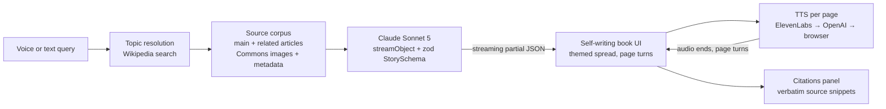

# Tome

**Ask history a question, out loud. A book writes itself in front of you: era typography, real archival art, a narrator, and a citation behind every line.**

Built solo in about 20 hours for the Null Fellows hackathon. Theme: *inter(action/faces)* — "every AI product is a chat interface; can you build a better way to interact with AI?" Tome's answer is to remove the chat entirely. The model's output is the interface: a designed, narrated, cited storybook, woven live from verified sources.

## What it does

You speak (or type) a history question. Tome resolves it to Wikipedia, fetches the main article plus the most story-relevant sub-articles (people, battles, treaties) and Wikimedia Commons artwork with artist, date, and license metadata. Claude weaves that corpus into a single schema-validated `Story` object — title, era theme, chapters, pages, scenes — streamed as JSON, so the book renders each page the moment it arrives. A narrator reads each page aloud and turns it when the audio ends, and tapping any page opens the verbatim source passages it was written from.

## The magic moments

- **The book writes itself.** Pages appear as skeletons and fill in as the model streams. The prompt forces title and theme to stream first, so the cover and era styling land before chapter one.
- **The model designs the book.** Per story, Claude picks an era label, a palette (hex-validated), one of five font pairings, and one of five page textures. A story about the Enlightenment does not look like a story about medieval monks.
- **Real artifacts, not generated imagery.** Portraits and maps are actual Wikimedia Commons files, classified heuristically (portrait / map / scene), displayed with a slow Ken Burns drift and captioned with painter and date.
- **It reads to you.** ElevenLabs narrates each page; when the audio ends, the page turns itself. If ElevenLabs is down it falls back to OpenAI TTS, then to the browser's own voice.
- **Provenance is one tap away.** Every scene must carry at least one citation with a verbatim quote from the source text. Tap a page and the marginalia panel slides in: the quote, the article, the section anchor, a link to Wikipedia.
- **You choose the depth.** Three reading depths — *Pamphlet* (a brisk tale), *Chronicle* (the full story), *Tome* (every detail). Depth scales the whole pipeline: how much source text is fetched (12k → 38k words), how many chapters the model is told to write (2-3 → 6-9), the narrative-density rules ("a single narration must never compress more than a few years of a life"), and the output token budget (12k → 40k).

## Architecture



| Stage | Where | Notes |
|---|---|---|
| Corpus | `lib/sources/` | Resolves free text to an article, harvests links, scores and picks up to 5 related articles, gathers up to 25 Commons images. Whole corpus capped near 25k words. |
| Weave | `app/api/story/route.ts`, `lib/story/prompt.ts` | One `streamObject` call against `claude-sonnet-5`. The scene discriminated union is too large for the API's default constraint-grammar mode, so the route uses `structuredOutputMode: 'jsonTool'`. |
| Contract | `lib/story/schema.ts` | Zod schemas for Story / Theme / 5 scene types. Narration capped at 700 chars per scene (the TTS unit); every scene requires citations. |
| Book | `components/book/`, `components/scenes/`, `lib/story/theme.ts` | Renders partial JSON with null guards everywhere; 3D page turns; theme becomes CSS custom properties; fonts via `next/font`. |
| Narration | `app/api/tts/route.ts`, `lib/tts/` | Provider fallback chain, audio disk-cached by `sha256(provider + voice + text)` with atomic writes. |
| Voice + citations | `components/voice/`, `components/citations/` | Web Speech API input with live interim transcript; marginalia panel deduped by url + snippet. |

## What is real vs. prebaked

| Piece | Status |
|---|---|
| Wikipedia + Commons corpus | Real, fetched live per query |
| Story weave | Real for anything you type or speak — a live streaming model call at your chosen depth |
| Prebaked showcase stories | `public/prebaked/` holds four stories baked by `scripts/prebake.ts` through the identical pipeline, with per-page ElevenLabs audio. The four landing chips replay them (labeled "From the archive" in the UI) so the pitch never depends on conference wifi. Typed and voice queries always weave live |
| Era theming | Chosen by the model per story, from a curated vocabulary that cannot render broken |
| Narration | Real ElevenLabs (OpenAI, then browser voice as fallbacks). Audio is disk-cached, so a repeated demo replays instantly |
| Voice input | Real Web Speech API (Chrome). Typing always works; the mic button hides itself where unsupported |
| Demo insurance | `lib/story/fixtures/` holds a saved Seven Years' War corpus — real Wikipedia/Commons data fetched earlier. `POST /api/story {fixture: true}` weaves from it if live Wikipedia is unreachable. The model call is still live |
| `/dev-book` | Dev preview harness: a hand-written mock story played through a simulated stream, used to build the book UI without spending API calls |
| Runware ambient art | Built: per-chapter frontispieces generated from the model's `ambientPrompt`, disk-cached per prompt, preloaded client-side, and degrading to no-art on any failure. Always secondary to real Commons artifacts |
| Kokoro local TTS | Stub only; reports itself unavailable so the fallback chain skips it |

## Hallucination guardrails

- The prompt injects the source text and image list verbatim, and the system prompt restricts the model to them.
- `StorySchema` is enforced through the tool schema; malformed output fails validation instead of rendering.
- Every scene must cite at least one source, and each citation's snippet is a verbatim quote from the corpus.
- Image URLs must be copied character-for-character from the injected Commons list. `scripts/test-weave.ts` runs a full weave and fails if any `imageUrl` or citation does not match the corpus exactly; snippet verbatim-ness is checked too.
- The renderer accepts only `https` image URLs and hides any image that fails to load.

This is prompt- and schema-level enforcement plus a test harness, not a proof that paraphrase errors are impossible. That is why provenance is in the UI: tap the passage, read the quote, click through to Wikipedia.

## Quickstart

Requires Node 20+ and Chrome (for voice input).

```bash
npm install
cp .env.local.example .env.local   # fill in keys, see below
npm run dev                        # open http://localhost:3000
```

| Key | Needed for |
|---|---|
| `ANTHROPIC_API_KEY` | Required. The story weave |
| `ELEVENLABS_API_KEY` | Optional. Best narration voice |
| `OPENAI_API_KEY` | Optional. TTS fallback |
| `RUNWARE_API_KEY` | Unused today (roadmap: ambient chapter art) |
| `TOME_MODEL`, `ELEVENLABS_VOICE_ID` | Optional overrides |

Without TTS keys the book still narrates, using the browser's built-in voice.

Live pipeline smoke tests (each hits real APIs):

```bash
npx -y tsx scripts/test-corpus.ts   # Wikipedia/Commons fetch + image URL checks
npx -y tsx scripts/test-weave.ts    # full weave, validates citations + image URLs against the corpus
npx -y tsx scripts/test-tts.ts      # each configured TTS provider produces real MP3 audio
```

`/dev-book` serves the book renderer against the mock story with restart, instant-render, and narration toggles — the harness the UI was built with.

## Roadmap

Pitched, deliberately not built in the 20 hours:

- **E-ink companion app** (Boox / reMarkable): the book belongs on paper-like screens.
- **Rendered video output**: the `Story` object is already a storyboard with narration timing.
- **Full cross-reference engine**: claim-level agreement badges checked against independent sources, beyond the current single-corpus citations.

## Sources and attribution

Article text comes from Wikipedia (CC BY-SA); images are served directly from Wikimedia Commons and carry artist, date, and license metadata through to their captions. Requests use a Wikimedia-policy `User-Agent`.
